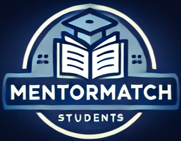

# MentorMatch

MentorMatch is a platform designed to connect students with experienced mentors for guidance, skill development, and feedback. Built to simplify the mentorship process, MentorMatch allows mentors to schedule sessions, share resources, and receive feedback from students. Whether you’re looking to learn something new or share your expertise, MentorMatch provides a structured way to facilitate productive learning sessions.

---

## Getting Started

### Link to the Deployed App
[MentorMatch](https://mentormatch-14e953a4dde1.herokuapp.com/#)

### Link to the Planning Materials
You can find all planning documents including wireframes, user stories, and ERDs here:
[Planning Materials](https://trello.com/b/maNqPijk/mentormatch)

## Features

- **User Roles**: Mentors and students can create accounts and manage their profiles.
- **Session Scheduling**: Users can schedule mentorship sessions with detailed date and time options.
- **Session Feedback**: Students can leave reviews and ratings for completed sessions.
- **Resource Sharing**: Mentors can upload and share resources with students during their sessions.
- **Dashboard**: A personalized dashboard where users can view upcoming sessions and manage their mentorship activities.
- **Authentication & Authorization**: Secure login and session management for users.
- **Responsive UI**: Designed with mobile-first in mind using Bootstrap.

---

## Attributions

MentorMatch was built using the following libraries and resources:

- [Bootstrap](https://getbootstrap.com/) - For responsive UI components.
- [EJS](https://ejs.co/) - Template engine for rendering dynamic views.
- [MongoDB & Mongoose](https://mongoosejs.com/) - For data modeling and database management.
- [Node.js](https://nodejs.org/) & [Express](https://expressjs.com/) - Backend framework for building the server and API.
- Background image on index page from [Freepik](https://www.freepik.com/)

Feel free to check out these great tools that helped make MentorMatch possible!

---

## Technologies Used

MentorMatch was built with the following technologies:

- **Frontend**: HTML5, CSS3, Bootstrap, EJS
- **Backend**: Node.js, Express.js
- **Database**: MongoDB, Mongoose
- **Authentication**: Express-Session

---

## Next Steps

Here are some planned future enhancements for MentorMatch:

- **File Uploads**: Enabling mentors to upload and share documents or other files as resources.
- **Session Reminders**: Automated reminders for both students and mentors as the session date approaches.
- **User Analytics**: A dashboard for mentors showing their feedback, rating trends, and session statistics.

---

## Contact

For any questions or suggestions, feel free to contact:

- **GitHub**: [luiscuriel-bit](https://github.com/luiscuriel-bit)